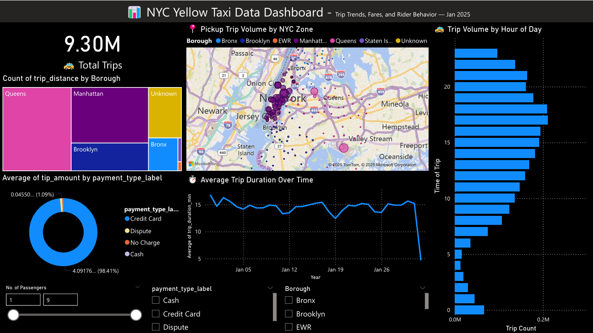

# 🚕 NYC Taxi Trip Analytics Dashboard — Power BI + PostgreSQL + Python

This project is an **end-to-end data engineering and analytics pipeline** built using NYC Yellow Taxi public trip data. It includes:

- 🐍 Python scripts to transform and load data
- 🐳 A Dockerized PostgreSQL database
- 📊 An interactive Power BI dashboard with maps, KPIs, and trends

---

## 📋 Project Overview

This project visualizes over **2.8 million NYC yellow taxi rides** using a custom ETL pipeline and interactive Power BI dashboards. The goal is to enable insight into trip volumes, fares, tipping behavior, spatial patterns, and ride trends across the city.

---

## 💾 Tools & Technologies Used

| Layer             | Tools                                 |
|------------------|----------------------------------------|
| Data Source       | NYC Yellow Taxi January 2023 (Parquet) |
| Programming       | Python (`pandas`, `psycopg2`)          |
| Data Warehouse    | PostgreSQL (via Docker)                |
| Dashboard         | Power BI                               |
| Orchestration     | Manual (optional upgrade: Airflow)     |
| Deployment        | GitHub                                 |

---

## 📁 Project Structure

```
nyc-taxi-powerbi-dashboard/ ├── powerbi/ │ └── NYC_Taxi_Analysis.pbix ← Final dashboard ├── data/ │ └── taxi_zone_lookup.csv ← TLC zone mapping ├── scripts/ │ ├── transform_data.py ← Data cleaning and feature engineering │ └── load_data.py ← Load to PostgreSQL ├── docker/ │ └── docker-compose.yaml ← Postgres container setup ├── .env.example ← DB connection config (safe) ├── README.md ← This file └── .gitignore ← Ignore sensitive/large files
```


---

## 📊 Dashboard Highlights

- **Top KPIs**: Total trips, average fare, tips, duration
- **Hourly Demand Chart**: Trips by pickup hour
- **Donut Chart**: Tip amount by payment type
- **Interactive Map**: Trip density by pickup zone
- **Duration Trend**: Avg. trip duration over time
- **Slicers**: Filter by passenger count, borough, payment type, and date
- **Extra Visuals**: Group fare behavior, treemap, and gauge for quick insights

---

## 💡 Key Insights

- 🚕 **Peak demand** occurs around 6–8 PM
- 💳 **Credit cards dominate** payment types, but cash tips vary more
- 🗺️ **Midtown and JFK** are top pickup zones
- ⏱️ **Trip duration** fluctuates based on time of day and passenger count
- 👥 Most rides are taken solo or in pairs

---

## 🧠 How to Use

1. Clone this repo
2. Use Docker to spin up PostgreSQL:
   ```bash
   cd docker
   docker-compose up -d
   ```
3. Run the ETL pipeline:
   ```
   python scripts/transform_data.py
   python scripts/load_data.py
   ```
5. Open the .pbix file in Power BI Desktop and explore the dashboard

## 📸 Dashboard Preview


## 🌐 Credits
NYC Taxi & Limousine Commission: TLC Trip Data

## 📤 Author
Hari Dave


